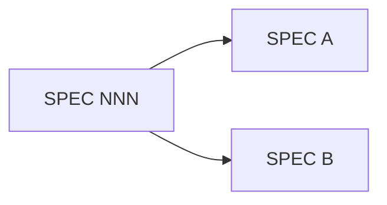

# SPEC [NNN] — [SHORT_TITLE]

<!--
  LX SPEC. Заполняется командой /speckit.specify.
  SPEC отвечает на «ЧТО и ЗАЧЕМ», а не «КАК» (это PLAN).
  Язык прозы — русский; идентификаторы кода/полей — как в коде (английский).
  Спецификация — живой документ: остаётся в репозитории навсегда как слой
  документации и источник инвариантов, на которые ссылается код.

  ВИЗУАЛЬНЫЕ КОНВЕНЦИИ (образец — Leadaxe SPEC; всё рендерится на GitHub, где живут спеки).
  Правило: каждый приём делает что-то СКАНИРУЕМЫМ за секунду; декор ради декора — убирай.
  • Проза — короткими абзацами, воздух между блоками; на каждый идентификатор/путь — инлайн `code`.
  • Схемы / layout / config / on-disk-дерево / pipeline — в fenced-блоках (```jsonc/go/text/json```), НЕ прозой.
  • Сравнения / семантика / перечни — таблицами.
  • Диаграммы — ```mermaid``` (GitHub рендерит) вместо абзаца: `flowchart/graph` — поток/зависимости;
    `stateDiagram-v2` — автоматы состояний (статусы, paused-окна, kill-латч); `sequenceDiagram` —
    многоакторные потоки (dual-publish, конвейеры); `timeline` — история версий/инцидентов (ситуативно).
  • Формулы — LaTeX `$…$` / `$$…$$` (GitHub рендерит): `$step=\frac{scale}{\gcd(p,scale)}$` читаемее бэктиков.
  • Сноски `[^имя]` — третий уровень провенанса между инлайном (шумно) и <details> (клик):
    строка остаётся чистой, «почему» — внизу документа с автообратной ссылкой.
  • Кликабельные пути: в «Где живёт» файлы — относительными ссылками `[`x.py`](../../x.py)` (карта кода =
    навигация); для deep-link на инвариант из PR — `<a id="invN"></a>` перед записью.
  • Акценты — GitHub-алерты: `> [!IMPORTANT]` зонтик · `> [!WARNING]` анти-инвариант/футган · `> [!NOTE]` контекст.
  • Многословное «почему»/деталь — под `<details><summary>…</summary>` (клик-раскрытие), спека остаётся тонкой.
  • Инвариант — утверждение (жирным) + инлайн-статус маркера `✓placed`/`☐planned` + короткие привязки; детали в <details>.
  • On-disk / file-tree — box-drawing `├──`/`└──`/`│` внутри ```text; typed-структуры — с разделителями `// ─── секция ───`.
  • Изменение формата (migration / schema-bump / «что выпилено↔добавлено») — ```diff-блок (`+`/`-`, красный/зелёный на GitHub).
  • Удалено / устарело / опровергнуто — `~~strikethrough~~` (`~~старое~~ → новое`; refuted-подозрение `~~…~~`).
  • Стрелки-словарь: `→` поток/трансформация · `↔` двунаправленно · `⊥` ортогонально/независимо · `⇒` следствие.
  • Typed-схемы — ```go/```python с выровненными инлайн-комментами (богаче, чем ```text).
  • Emoji — ЗАКРЫТЫЙ СЛОВАРЬ статусов в фиксированной позиции (глиф = один смысл, точные кодпоинты):
    ✅/❌ можно/нельзя · ✓/— тест есть/дыра · ☑/☐ placed/planned · 🔴/🟢 severity/health · ⚠️ футган · 🎯 MVP.
    Декоративные emoji (заголовки/проза: 🚀💡📋…) — НЕТ: плотность убивает салиентность, открытая
    семантика = двусмысленность. Ценность ⚠️ — в его редкости.
  • `---` разделяет крупные смысловые половины; в длинных спеках нумеруй секции (`## 1.`, `## 2.` — для ссылок «§8»).

  ЯЗЫК И ЛЕГЕНДА (правило «холодного читателя» действует на ВЕСЬ документ, не только Проблему):
  • ПРОЕКТНЫЙ ШИФР (тикет-префиксы вроде COD-N, внутренние сокращения вроде D-1/H1/gcd-1) —
    расшифровка в 3–7 слов при ПЕРВОМ употреблении в каждой спеке; спека читается без соседних.
  • МАТ-НОТАЦИЯ (`⊥ ⟺ ∧ ⇒`) в требованиях/инвариантах — либо словами, либо с легендой;
    один символ = ОДИН смысл по всему корпусу (⊥ «независимы» и ⊥ «гейтится» — авария прочтения).
  • ТЕЛЕГРАФ-ПУНКТ: если пункт требований содержит 3+ независимых проверяемых условия —
    расщепи (EARS-строки или таблица «условие → действие»).
-->

**Status:** [Draft | New (N) | Open (O) | Merged (M) | Shipped (S) | Complete (C) | Closed-no-impl]
**Type:** [Feature (F) | Bug (B) | Refactor (R) | Question/Research (Q)]
**Depends on:** [SPEC NNN (роль связи) | —]
**Supersedes / Consolidates:** [SPEC NNN (поглощён сюда) | —]
**Schema bump:** [Не требуется | state.json vN→vN+1 | config format | —]
**Release:** [vX.Y.Z | commit/date-anchor, если тегов нет (напр. host-smoke `<hash>`, YYYY-MM-DD) | не привязано]

> Принцип: **одна фича — один SPEC**. Если задача поглощает более ранние черновики,
> перечисли их в *Consolidates* и не создавай параллельных документов.

---

## Проблема

<!-- Что не работает / чего не хватает и ПОЧЕМУ это важно. Начни с боли пользователя
     или инженерного ограничения, а не с решения.
     ХОЛОДНЫЙ ЧИТАТЕЛЬ (обязательное правило Проблемы и Цели):
     • пиши для того, кто НЕ читал соседних спеков и не может спросить автора;
     • жаргон/доменный термин — расшифровать при ПЕРВОМ употреблении (что такое, почему важно);
     • ключевая механика (почему проблема вообще существует) — объяснена словами, не спрятана в скобку;
     • тезис ≠ проблема: находка/edge — контекст, а проблема — что без этой работы сломано/невозможно.
     Тест: человек со стороны пересказывает проблему своими словами? Нет → переписать. -->

### Текущее состояние (до работы)

<!-- Как есть сейчас, по коду: файлы, поведение, ограничение. Даёт точку отсчёта
     и потом становится частью исторического контекста спека. -->

## Цель

<!-- 1–3 предложения С ГЛАГОЛОМ (не безглагольный именной фрагмент): какое наблюдаемое
     поведение должно появиться. Читается ДО требований и понятна БЕЗ них — если цель
     расшифровывается только через R1–Rn, она телеграфна → разверни. Нумерованные
     подпункты (1) … 2) … 3)…) лучше одной фразы с четырьмя оборотами. -->

## Требования

<!-- Нумерованный, проверяемый список. Формулируй как условия приёмки, а не задачи.
     Группируй по подсистемам/протоколам, если требований много. -->

1. R1 — …
2. R2 — …

## Инварианты (локальные — что НЕ меняется в этой способности)

<!-- КЛЮЧЕВАЯ секция LX. Только ЛОКАЛЬНЫЕ инварианты этой способности (контракт, привязанный
     к коду+тесту). СИСТЕМНЫЕ (сквозные, структурные) — НЕ здесь, а в Constitution §2; каждый
     локальный ССЫЛАЕТСЯ на свой зонтик там (`§N`). Провенанс — БЕЗ git-хешей (маркер + `git blame`).
     ВЫНОС: инвариантов ≥3 → полные записи в `invariants.md` (таблица-тест-матрица), а ЗДЕСЬ —
     терсный ИНДЕКС (заголовки + ссылка). При <3 — держи инлайн (см. закомментированный вариант). -->

> [!IMPORTANT]
> Зонтик — Constitution §N: <почему эта способность несёт инварианты — 1 строка>.

### Индекс — полные записи в [`invariants.md`](invariants.md)

<!-- Только утверждения, для сканирования; код·тест·провенанс·маркер·дыры покрытия — в invariants.md.
     Индекс и invariants.md держи синхронными (INVn — утверждение совпадают); `analyze` это сверяет. -->

- **INV1** — <утверждение; читается само>.
- **INV2** — <утверждение>.
- **INV3** — <утверждение, выученное сбоем>.

<!-- ПРИ <3 ИНВАРИАНТАХ — без отдельного файла, инлайн (трёхстрочный формат: имя → EARS-контракт → привязки):
- **INV1 — <короткое имя>.** ✓placed
  WHEN <триггер> THEN system SHALL <обязательство> / IF <сбой> THEN … SHALL …, NEVER <нельзя>.
  ↳ `file:symbol` · `test_name` · почему: <R<n> / §<Const> / инцидент: …> · §зонтик
-->


## Где живёт (карта кода — опционально)

<!-- As-built навигация: файл · символ · роль. Заменяет пустой PLAN.md для мелких/ретро-спек,
     но даёт точку входа для будущих forward-правок. Для крупной задачи вынеси в PLAN.md. -->

| Файл | Символ | Роль |
|------|--------|------|
| `path/to/file` | `func/type` | … |

## Схема / контракт данных (для спек-владельцев — опционально)

<!-- Заполняй ТОЛЬКО если эта спека — источник истины для формы данных
     (тип на шине, схема файла состояния, on-disk формат). Покажи ФОРМУ, а не прозу:
     будущий потребитель и бэктест должны видеть точный контракт, а не выводить его
     из инвариантов. Пропусти секцию целиком, если спека не владеет данными. -->

**Тип / схема** (поле · тип · семантика):

```text
TypeName{ field: type — что это; ts_event=… ; ts_init=… ; … }
```

**Раскладка на диске** (для data-heavy — где и по какому ключу лежит + размерная математика):

```text
{root}/.../{id}/*.ext        — что лежит
порог ротации / retention → on-disk-эффект (напр. 3 MB counted ≈ 27 MB диск)
```

**Migration / back-compat** (обязательно, если во front-matter задан `Schema bump`):

- **Направление:** одно-/двунаправленно; поведение при откате (downgrade → regenerate / ошибка / …).
- **Старые артефакты:** что с ними (конвертация/дроп/lazy-GC), **кто** её делает и **когда** (старт/миграция).

## Вне scope (non-goals)

<!-- Что сознательно НЕ делается в этой задаче. Границы = защита от расползания scope.
     Если что-то вынесено в отдельный будущий SPEC — укажи предварительный номер. -->

- …

## Отклонённые альтернативы / Что НЕ сделано (опционально, но ценно)

<!-- Самое долговечное знание — то, чего в коде НЕТ: что пробовали и почему отказались,
     что сознательно отложили. Выноси на первый план (образец — sing-box-lx §«ОТВЕРГНУТО»),
     а не прячь в «почему» инварианта. Пропусти, если отвергать было нечего. -->

- **Отвергнуто:** <подход> — почему проиграл (замер/инцидент/`[git]`), чем заменён.
- **Отложено сознательно:** <что> — причина и условие возврата (→ SPEC NNN, если вынесено).

---

## Критерии приёмки

<!-- Проверяемые условия «сделано». Каждый критерий ССЫЛАЕТСЯ на тест/проверку
     (`(test_name)`), а не на «проверено глазами». Обязательно включают «зелёную ветку».
     ФОРМА: рекомендуется EARS (заимствовано из Kiro) — критерий как исполняемый сценарий:
       WHEN [триггер] THEN system SHALL [результат] · IF [невалидное] THEN … SHALL … ·
       WHILE [состояние] … SHALL … · WHERE [режим] … SHALL … · запрет — NEVER.
     Слова «быстро/удобно/корректно» без измеримого SHALL — не критерий. -->

- [ ] WHEN <триггер/сценарий> THEN system SHALL <наблюдаемый результат> — `(test_name)`
- [ ] Сборка/тесты/анализ зелёные — одной командой (Definition of Done, см. checklist)
- [ ] Инварианты INV1–INVn сохранены и подтверждены (тест из записи инварианта / host-smoke)

## Риски и смягчение

| Риск | Вероятность/эффект | Смягчение |
|------|--------------------|-----------|
|      |                    |           |

## Связи (трассируемость)

<!-- Двунаправленные ссылки. Роли связи различаются явно.
     Second Brain: долговечные уроки/памятки, переживающие эту задачу, линкуй в базу знаний
     через `[[note-slug]]` (Obsidian-vault). Спека — узел в графе знаний; ссылайся, не пересказывай.
     Образец — sing-box-lx (`[[awg-detour-guard-must-be-at-start]]`). -->

- **Зависит от:** SPEC NNN — …
- **Порождает:** будущий SPEC (предв. номер …) — …
- **Референс:** SPEC NNN / docs/… — …
- **Память (Second Brain):** `[[note-slug]]`, `[[…]]` — долговечные памятки/уроки в базе знаний.

### Трассировка: маркеры (planned → placed)

<!-- Статус маркера теперь ИНЛАЙН у каждого инварианта (`✓placed`/`☐planned`) — отдельная
     таблица НЕ обязательна. Оставь эту сводную таблицу ТОЛЬКО если маркеров много и нужен
     обзор одним взглядом. Полный текст маркера живёт в КОДЕ (`// SPEC [NNN] invariant: …`).
     /speckit.lx.trace ронёт, пока есть planned: без простановки связь односторонняя. -->

<!-- (опционально, сводный вид)
| Код-сайт | Инвариант | Статус |
|----------|-----------|--------|
| `file:symbol` | INV1 | ☑ placed |
-->


